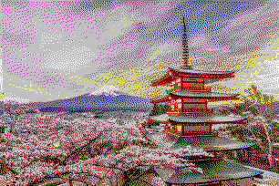

Tool for images encoding and decoding with 4 bits per pixel efficiency

**!!!Warning!!!**

during encoding input image is rewritten with a 4bit palette

**Tool features:**

- 16-color palette (, , , , , , , , , , , , , , , 
- 4 bits per symbol encoding due to reduced palette
- AES128 encryption-decryption (length-preserving) available
- Floyd Steinberg dithering available

**Build:**

    cargo build --release

**Usage:**

    exe [options] [input_file_path] [output_file_path] [base64url_key(opt)]

    options:
        - e - encode mode: input - existing [input_file_path], output - saved [output_file_path] or stderr
        - p - enable dither processing for image encoding (can be disabled when re-encoding of already dithered images)
        - d - decode mode: input - existing [input_file_path], output - saved [output_file_path] or stderr
        - ee - encode-encrypt mode: input - existing [input_file_path] and [base64url_key], output - saved [output_file_path] or stderr
        - dd - decode-decrypt mode: input - existing [input_file_path] and [base64url_key], output - saved [output_file_path] or stderr
        - g - 16bytes base64url stdout key gen (doesn not need any input)

"**Examples:**

- input image:

- target/release/rust_bit4-img-codec eep image.png encoded.bin GqhLxZ5fhzDbc9pCpoKN4g:
    *saved ./encoded.bin file

- target/release/rust_bit4-img-codec dd encoded.bin decoded.png GqhLxZ5fhzDbc9pCpoKN4g:
    *saved ./decoded.png image

- output image:

**Some details:**

- max image size is 4095x4095, so the first three bytes of encoded is the image dimensions
- dithering can damage images with many areas of the same color
